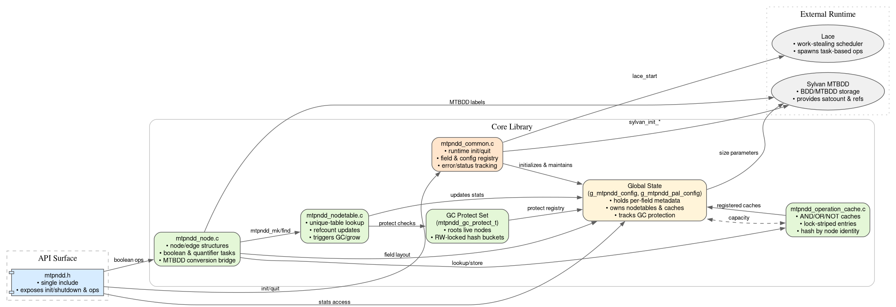

# MTPNDD: A library for Multi-Terminal Network Decision Diagram in **Parallel**

使用 C 语言重构 NDD，并实现并行和多终端节点需求

## Architecture



## Build and Run

* Sphinx for doc generating

https://www.sphinx-doc.org/en/master/usage/installation.html

for macOS,

```bash
brew install sphinx-doc
```

### MTPNDD with Sylvan and Lace

```bash
cd sylvan
mkdir build
cd build
cmake .. #-DMTPNDD_ENABLE_RECORDING=ON
make
```

### JNI

```bash
cd jni
cmake -B build -DMTPNDD_LIBRARY_PATH=/absolute/path/to/libmtpndd.a
cmake --build build      # 得到 build/libmtpnddjni.so

mvn package              # 产出 target/mtpndd-java-0.1.0-SNAPSHOT.jar
```

### Configuration

可通过 `mtpndd_pal_config_t` 提供的可选字段调整内部哈希表的桶数量：

```c
mtpndd_pal_config_t config = {
    .n_workers = 0,
    .lace_dqsize = 1 << 18,
    .bdd_nodetable_size = 1 << 16,
    .mtpndd_nodetable_size = 1 << 14,
    .op_cache_size = 1 << 12,
    .edge_bucket_count = 32,          // 默认为 8
    .nodetable_bucket_count = 1 << 12, // 默认为 1024 或 65537 (LARGE_NODETABLE)
    .gc_bucket_count = 1 << 12         // 默认为 1024 或 65537
};
mtpndd_init(&config);
```

未配置时会自动使用默认值，适合小规模问题。对于节点/边数量巨大的场景，可以按需增大桶数量以降低哈希冲突。

## Visualization

调用 `mtpndd_print_dot(root)` 或 `mtpndd_fprint_dot(file, root)` 可以把当前节点为根的 NDD 导出为 DOT 描述。例如：

```c
FILE *fp = fopen("graph.dot", "w");
mtpndd_fprint_dot(fp, my_root);
fclose(fp);
// dot -Tpng graph.dot -o graph.png
```

默认的 `mtpndd_print_dot` 会直接输出到标准输出，便于通过管道交给 Graphviz 处理。

## License

Apache-2.0 License, see [LICENSE](LICENSE).
