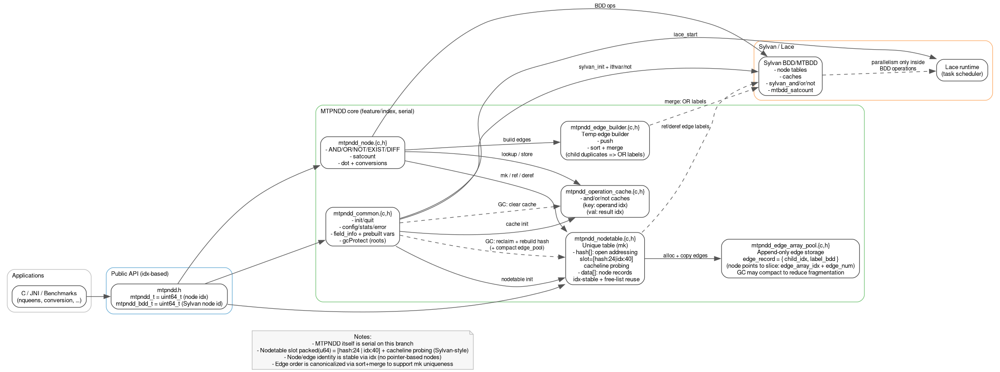
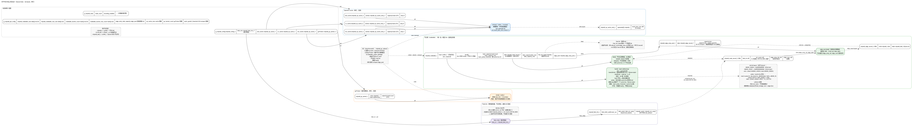

# MTPNDD: A library for Multi-Terminal Network Decision Diagram in **Parallel**

使用 C 语言重构 NDD，并实现并行和多终端节点需求

> 分支说明
>
>
>
> ndd: 原始 ndd 修改 guava 依赖
>
> feature/sylvan: java 改 单例模式 JSylvan 串行
>
> feature/lockmap: java JSylvan parallelStream 并行（失败）
>
> feature/c: hashmap 并行
>
> feature/serial: hashmap 串行
>
> feature/index: array 串行

## Architecture



## Core Memory Design（feature/index）



## Build and Run

<details>
<summary>Sphinx for doc generating</summary>

https://www.sphinx-doc.org/en/master/usage/installation.html

for macOS,

```bash
brew install sphinx-doc
```
</details>

### MTPNDD with Sylvan and Lace

```bash
cd sylvan
cmake -B build -DMTPNDD_ENABLE_RECORDING=ON
cmake --build build     # 生成 libsylvan.a、libmtpndd.a 等
./build/src/sylvan/mtpndd/mtpndd_nqueens_test 8
```

### JNI

```bash
cd jni
cmake -B build -DMTPNDD_ENABLE_RECORDING=ON
cmake --build build     # 得到 build/libmtpnddjni.so

mvn -DskipTests package # 产出 target/mtpndd-java-0.1.0-SNAPSHOT.jar
mvn -Dorg.ants.mtpndd.library.path="$PWD/build/libmtpnddjni.so" test
java -Dorg.ants.mtpndd.library.path=$PWD/build/libmtpnddjni.so -cp target/mtpndd-java-0.1.0-SNAPSHOT.jar:target/test-classes org.ants.mtpndd.NQueensMTPNDD 8 onehot
```

### Configuration（feature/index：idx-based）

`feature/index` 分支中，MTPNDD 节点改为 `idx` 表示（`mtpndd_t = uint64_t`），边集改为连续数组（`edge_array_pool`），不再使用“节点边集 hashmap / slab memory pool”结构。配置项更偏向于：初始容量（hint）+ 缓存大小。

```c
mtpndd_pal_config_t config = {
    .n_workers = 0,
    .lace_dqsize = 1 << 18,

    // Sylvan (BDD/MTBDD) sizes
    .bdd_nodetable_size = 1 << 16,
    .op_cache_size = 1 << 12,

    // MTPNDD (idx nodetable) sizing hints
    .mtpndd_nodetable_size = 1 << 14,         // nodetable.data[] 初始/最小容量（节点记录数）
    .mtpndd_nodetable_max_size = 1 << 20,     // nodetable.data[] 最大容量（增长可倍增到该上限；0/未填 => 等于 min）
    .nodetable_bucket_count = 1 << 12,        // nodetable.hash[] 初始/最小容量（开放寻址）
    .nodetable_bucket_max_count = 1 << 20,    // nodetable.hash[] 最大容量（增长可倍增到该上限；0/未填 => 等于 min）
    .edge_entry_slab_capacity = 1 << 14,      // edge_array_pool 初始容量 hint（单位：edge_record 个数）

    // gcProtect（临时根集合）容量；GC 触发/compaction 的阈值可用 quick_growth_threshold 控制
    .gc_bucket_count = 1 << 12,
    .quick_growth_threshold = 0.10,
};
mtpndd_init(&config);
```

补充：
- `mtpndd_gc_collect()` 会清理算子缓存并回收 `ref_count==0` 的节点；当 `edge_array_pool` 碎片比例高时，会在 GC 中进行 compact（整块重建以释放碎片，思路类似 Sylvan 的 stop-the-world GC）。
- nodetable 的 `hash[]` slot 采用 Sylvan-style packed：`[hash:24 | idx:40]`（hash 不同可直接跳过边集比较）。
- `edge_bucket_count/node_slab_capacity/nodetable_entry_slab_capacity/edge_map_slab_capacity/gc_protect_entry_slab_capacity` 等字段在 `feature/index` 中属于历史遗留/暂未使用（后续会逐步清理或重新命名）。

## Visualization

设计/内存图（见 `docs/`，可用 `dot -Tpng *.dot -o *.png` 重新生成）：
- `docs/mtpndd_architecture_zh.png`（模块架构）
- `docs/mtpndd_memory_design_zh.png`（核心内存布局）
- `docs/mtpndd_mk_flow_zh.png`（`mtpndd_mk` 唯一化流程）

调用 `mtpndd_print_dot(root)` 或 `mtpndd_fprint_dot(file, root)` 可以把当前节点为根的 NDD 导出为 DOT 描述。例如：

```c
FILE *fp = fopen("graph.dot", "w");
mtpndd_fprint_dot(fp, my_root);
fclose(fp);
// dot -Tpng graph.dot -o graph.png
```

默认的 `mtpndd_print_dot` 会直接输出到标准输出，便于通过管道交给 Graphviz 处理。

## License

Apache-2.0 License, see [LICENSE](LICENSE).
