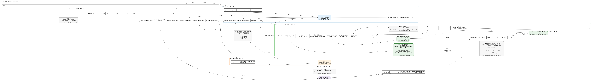

# MTPNDD: A library for Multi-Terminal Network Decision Diagram in **Parallel**

使用 C 语言重构 NDD，并实现并行和多终端节点需求

## 分支说明

| 分支 | 实现方式 | 状态 | 说明 |
|------|---------|------|------|
| `ndd` | Java | 历史版本 | 原始 NDD，修改 guava 依赖 |
| `feature/sylvan` | Java + Sylvan | 历史版本 | 单例模式 JSylvan 串行实现 |
| `feature/lockmap` | Java | 已废弃 | JSylvan parallelStream 并行（失败） |
| `feature/c` | C | 历史版本 | hashmap 并行实现 |
| `feature/serial` | C | 历史版本 | hashmap 串行实现 |
| `feature/index` | C | **当前主分支** | idx-based array 实现（性能最优） |

## Architecture


## Core Memory Design（feature/index）



## Build and Run

<details>
<summary>Sphinx for doc generating</summary>

https://www.sphinx-doc.org/en/master/usage/installation.html

for macOS,

```bash
brew install sphinx-doc
```
</details>

### 编译选项

MTPNDD 提供多个 CMake 编译选项来控制功能和性能：

| 选项 | 默认值 | 说明 |
|------|--------|------|
| `MTPNDD_ENABLE_RECORDING` | `OFF` | 启用性能统计（节点数、缓存命中率、时间等） |
| `MTPNDD_ENABLE_EDGE_STATS_FILE` | `OFF` | 启用边统计文件输出到 txt 文件（需要 RECORDING=ON）<br>**模块化设计**：禁用时零开销 |
| `MTPNDD_NQUEENS_ENABLE_DOT` | `OFF` | N-Queens 测试生成 DOT 图形（按需启用） |

**边统计模块**（`mtpndd_edge_stats.c/h`）：
- 独立的文件 I/O 模块，记录 AND/OR/DIFF 操作的输入边数
- 通过 `mtpndd_edge_stats_open()/close()` 控制文件输出
- 禁用时编译为零成本 no-op 函数，不影响性能

**配置示例**:

```bash
# 生产环境（最佳性能，无统计）
cmake -B build

# 开发调试（启用统计，控制台输出）
cmake -B build -DMTPNDD_ENABLE_RECORDING=ON

# 深度分析（统计 + 文件输出）
cmake -B build -DMTPNDD_ENABLE_RECORDING=ON -DMTPNDD_ENABLE_EDGE_STATS_FILE=ON

# 可视化调试（生成 DOT 图形）
cmake -B build -DMTPNDD_NQUEENS_ENABLE_DOT=ON
```

### MTPNDD with Sylvan and Lace

```bash
cd sylvan
cmake -B build
cmake --build build     # 生成 libsylvan.a、libmtpndd.a 等
./build/src/sylvan/mtpndd/mtpndd_nqueens_test 8

# 需要性能统计时添加 -DMTPNDD_ENABLE_RECORDING=ON
```

### JNI

```bash
cd jni
cmake -B build
cmake --build build     # 得到 build/libmtpnddjni.so

mvn -DskipTests package # 产出 target/mtpndd-java-0.1.0-SNAPSHOT.jar
mvn -Dorg.ants.mtpndd.library.path="$PWD/build/libmtpnddjni.so" test
java -Dorg.ants.mtpndd.library.path=$PWD/build/libmtpnddjni.so -cp target/mtpndd-java-0.1.0-SNAPSHOT.jar:target/test-classes org.ants.mtpndd.NQueensMTPNDD 8 onehot
```

### 运行时配置参数

MTPNDD 采用 idx-based 设计（`mtpndd_t = uint64_t`），边集使用连续数组（`edge_array_pool`）存储。配置参数主要包括：初始容量（hint）和缓存大小。

```c
mtpndd_pal_config_t config = {
    .n_workers = 0,
    .lace_dqsize = 1 << 18,

    // Sylvan (BDD/MTBDD) sizes
    .bdd_nodetable_size = 1 << 16,
    .op_cache_size = 1 << 12,

    // MTPNDD (idx nodetable) sizing hints
    .mtpndd_nodetable_size = 1 << 14,         // nodetable.data[] 初始/最小容量（节点记录数）
    .mtpndd_nodetable_max_size = 1 << 20,     // nodetable.data[] 最大容量（增长可倍增到该上限；0/未填 => 等于 min）
    .nodetable_bucket_count = 1 << 12,        // nodetable.hash[] 初始/最小容量（开放寻址）
    .nodetable_bucket_max_count = 1 << 20,    // nodetable.hash[] 最大容量（增长可倍增到该上限；0/未填 => 等于 min）
    .edge_entry_slab_capacity = 1 << 14,      // edge_array_pool 初始容量 hint（单位：edge_record 个数）

    // gcProtect（临时根集合）容量；GC 触发/compaction 的阈值可用 quick_growth_threshold 控制
    .gc_bucket_count = 1 << 12,
    .quick_growth_threshold = 0.10,
};
mtpndd_init(&config);
```

**补充说明**：
- `mtpndd_gc_collect()` 会清理算子缓存并回收 `ref_count==0` 的节点；当 `edge_array_pool` 碎片比例高时，会在 GC 中进行 compact（整块重建以释放碎片，思路类似 Sylvan 的 stop-the-world GC）。
- nodetable 的 `hash[]` slot 采用 Sylvan-style packed：`[hash:24 | idx:40]`（hash 不同可直接跳过边集比较）。

## Documentation and Tools

### 📚 Documentation

项目文档位于 `docs/` 目录：

**架构与设计**:
- `mtpndd_architecture_zh.png` - 模块架构图
- `mtpndd_memory_design_zh.png` - 核心内存布局（feature/index）
- `mtpndd_mk_flow_zh.png` - 节点唯一化流程

**性能优化**:
- `memory_optimization_analysis.md` - 详细的内存优化分析和实施策略
- `memory_analysis_summary.md` - 内存使用测量结果和优化建议摘要
- `temp_refs_results.md` - temp_refs 优化的性能提升记录（16.3%）
- `optimization_analysis.md` - 性能优化总览

### 🛠️ Tools

内存分析工具位于 `tools/` 目录：

**measure_memory.sh** - 内存使用测量工具
```bash
# 快速测量（/proc 监控）
./tools/measure_memory.sh proc ./build/src/sylvan/mtpndd/mtpndd_nqueens_exp 12 1

# 详细分析（Valgrind Massif）
./tools/measure_memory.sh massif ./build/src/sylvan/mtpndd/mtpndd_nqueens_exp 10 1
```

**memory_compare.sh** - 批量对比测试
```bash
# 测试 N=10,11,12 并生成对比报告
./tools/memory_compare.sh
```

详细使用方法参见 `tools/README.md`

## Visualization

调用 `mtpndd_print_dot(root)` 或 `mtpndd_fprint_dot(file, root)` 可以把当前节点为根的 NDD 导出为 DOT 描述。例如：

```c
FILE *fp = fopen("graph.dot", "w");
mtpndd_fprint_dot(fp, my_root);
fclose(fp);
// dot -Tpng graph.dot -o graph.png
```

默认的 `mtpndd_print_dot` 会直接输出到标准输出，便于通过管道交给 Graphviz 处理。

## License

Apache-2.0 License, see [LICENSE](LICENSE).
